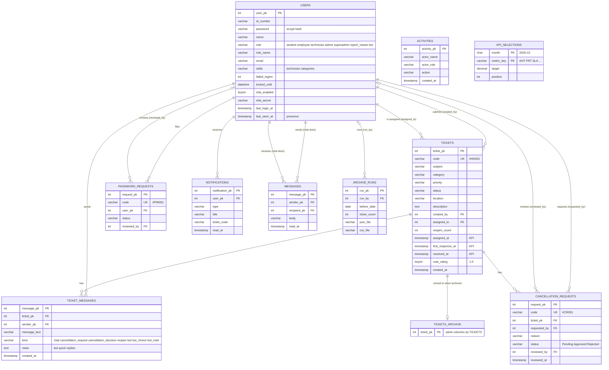

# Report Manager metrics and ERD

## What appears in the Report Manager

The Report Manager (Super Admin and Report Viewer) shows three things, top to bottom.

### 1. The chosen KPIs (the highlighted cards)

The super admin picks which metrics show for each month with **Choose KPIs**. Until a choice is saved, these **6 default KPIs** appear:

| Key | KPI | Unit | Better when | Target | What it measures |
|-----|-----|------|-------------|--------|------------------|
| AHT | Average Handling Time | minutes | lower | 480 | Time from assignment to resolved |
| FRT | First Response Time | minutes | lower | 30 | Time until IT first replies or assigns |
| SLA | SLA Compliance | % | higher | 90 | Tickets resolved within the priority's target (High 4 h, Medium 8 h, Low 24 h) |
| FCR | First-Time Fix Rate | % | higher | 90 | Resolved tickets that were never reopened |
| RR | Resolution Rate | % | higher | 85 | Tickets resolved out of those submitted |
| BKL | Open Backlog | count | lower | 10 | Tickets still Open or In Progress |

The other 9 metrics can be switched on in the picker: ART (Average Resolution Time), TTA (Time to Assign), REO (Reopen Rate), HPR (High-Priority Resolution Rate), SKM (Skill Match Rate), VOL (Ticket Volume), CAN (Cancellation Rate), AGE (Backlog Age), TPT (Tickets Resolved per Technician). Formulas: [KPI-METRICS.md](KPI-METRICS.md) and `server/kpiCatalog.js`.

Below the cards is the **KPI trend** chart: any chosen KPI over six months, with its target as a dashed line.

### 2. The detailed charts (follow the date, category and role filters)

| Report | Chart type |
|--------|-----------|
| Ticket volume over time | Line, per day |
| Tickets by status | Donut |
| Tickets by priority | Bar |
| Tickets by category | Bar |
| Requests by requester role | Bar |
| Campus location map | Heat map of where requests come from |
| Registered users by role | Bar (not affected by filters) |

### 3. Export

CSV export of the filtered data and the KPI values.

## ERD

Notes:
- `TICKET_MESSAGES_ARCHIVE` and `CANCELLATION_REQUESTS_ARCHIVE` mirror their live tables (left out of the diagram for readability). The view `tickets_all` joins live and archived tickets, so reports and KPIs never change when tickets are archived.
- `ACTIVITIES` (the activity log) and `KPI_SELECTIONS` (which KPIs show per month) are standalone: they store names and keys, not foreign keys.
- Tickets created by the HelpDesk Assistant reuse `TICKET_MESSAGES` (sender is the `bot` user).
